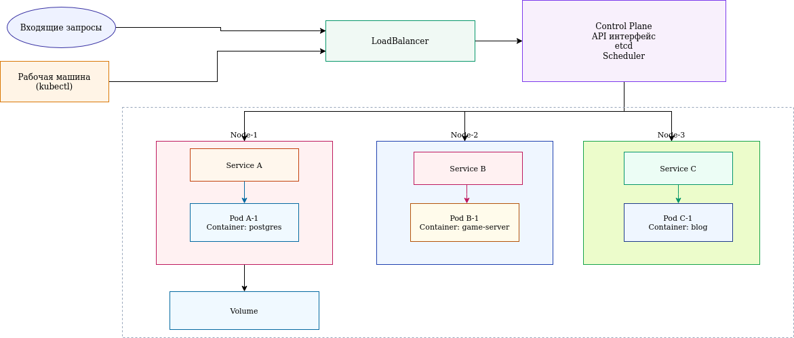

<!-- HEADER-PREPENDED -->

 МИНИСТЕРСТВО ЦИФРОВОГО РАЗВИТИЯ, СВЯЗИ И МАССОВЫХ КОММУНИКАЦИЙ РОССИЙСКОЙ ФЕДЕРАЦИИ 

Ордена Трудового Красного Знамени федеральное государственное бюджетное образовательное учреждение высшего образования 

 <strong> «Московский технический университет связи и информатики» </strong> 

  

 Кафедра «Радиотехника и телевидение(РиТ)» 

 

  Отчет по лабораторной работе №3.11 

по дисциплине 

<b>«Введение в информационные технологии»</b>

       
  
  Выполнил: студент группы 

  
        БИК2506 

  
  Харьков Степан Александрович

  
  Проверил:

  
 Старший преподаватель кафедры ТиЗВ Егоров Дмитрий Аркадьевич
  

   
   

  
  Москва, 2025 г. 

  

# Упражнение 3.11

Нарисуем диаграму для kubernetes кластера где есть 3 хост машины и 2 приложения: блог и сервер игры.
Также на одной хост машине присутствует база данных

