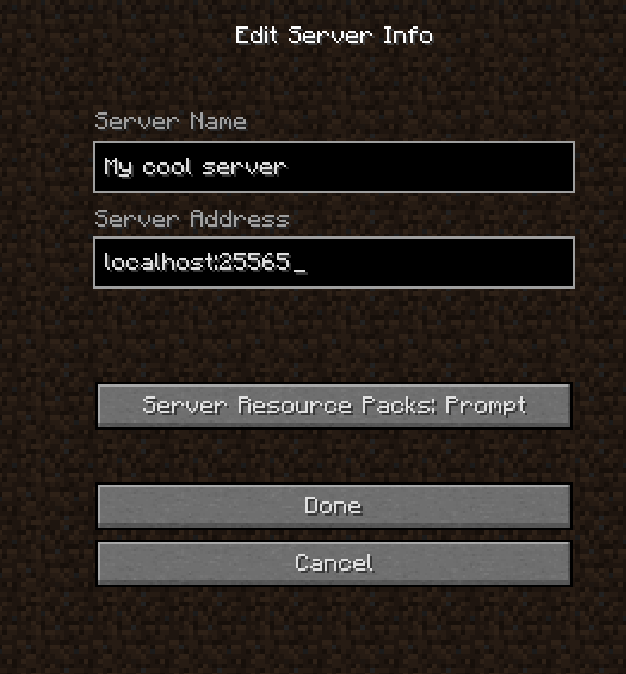
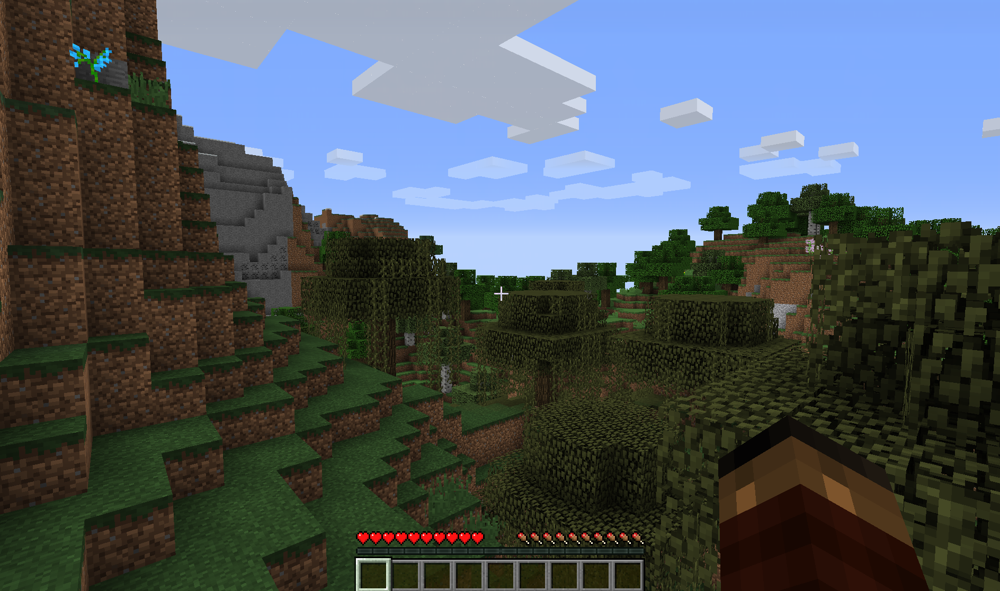

# Цель работы
Ознакомиться с основами контейнеризации и Docker. Установить и настроить Docker Desktop.
Научиться скачивать и запускать Docker-образы из Docker Hub.
Развернуть Minecraft-сервер в Docker-контейнере.
Протестировать работоспособность развернутого Minecraft-сервера.


# Ход работы


## 1. Установка Docker

Для установки `Docker` используется команда
```
sudo xbps-install docker
```

Для того, чтобы каждый раз не писать `sudo` можно сразу добавить пользователя в группу `docker`
```
sudo usermod -aG docker darkserius
```

## 2. Настройка и запуск Minecraft-сервера

Будем использовать версию Minecraft 1.12.2. Для начала скачаем необходимый `docker` образ.
```
docker pull itzg/minecraft-server:java16
```

Теперь запустим сервер на версии 1.12.2. В документации сказано, что версия выбирается через 
переменную окружения.
```
docker run -d -p 25565:25565 --name minecraft -e ONLINE_MODE=FALSE -e EULA=TRUE -e VERSION=1.12.2 -v $(pwd)/minecraft_data:/data itzg/minecraft-server:java16
```

Проверим запущен ли контейнер:
```
❯ docker ps
CONTAINER ID   IMAGE                          COMMAND                  CREATED         STATUS                            PORTS                      NAMES
61e27f86ab1f   itzg/minecraft-server:java16   "/image/scripts/start"   4 seconds ago   Up 3 seconds (health: starting)   0.0.0.0:25565->25565/tcp   minecraft
```

И глянем логи:
```
❯ docker logs minecraft
[init] Running as uid=1000 gid=1000 with /data as 'drwxr-xr-x 2 1000 1000 4096 Apr 16 18:42 /data'
[init] Image info: buildtime=2026-04-16T18:42:07.280Z,version=java16,revision=97407c672fccc431e5eca6d4c1d008972b5f230f
[init] Resolving type given VANILLA
[init] Resolved version given 1.12.2 into 1.12.2
[init] Downloading 1.12.2 server...
[init] Copying any configs from /config to /data/config
[init] Creating server properties in /data/server.properties
[init] Disabling whitelist functionality
[mc-image-helper] 02:48:07.286 INFO  : Created/updated 5 properties in /data/server.properties
[init] Setting initial memory to 1G and max to 1G
[init] Starting the Minecraft server...
[Log4jPatcher] [INFO] Transforming org/apache/logging/log4j/core/lookup/JndiLookup
[Log4jPatcher] [INFO] Transforming org/apache/logging/log4j/core/pattern/MessagePatternConverter
2026-04-20 02:48:10,041 main ERROR Error processing element Queue ([Appenders: null]): CLASS_NOT_FOUND
2026-04-20 02:48:10,065 main ERROR Unable to locate appender "ServerGuiConsole" for logger config "root"
[02:48:10] [Server thread/INFO]: Starting minecraft server version 1.12.2
[02:48:10] [Server thread/INFO]: Loading properties
[02:48:10] [Server thread/INFO]: Default game type: SURVIVAL
[02:48:10] [Server thread/INFO]: Generating keypair
[02:48:11] [Server thread/INFO]: Starting Minecraft server on *:25565
[02:48:11] [Server thread/INFO]: Using epoll channel type
[02:48:11] [Server thread/WARN]: **** SERVER IS RUNNING IN OFFLINE/INSECURE MODE!
[02:48:11] [Server thread/WARN]: The server will make no attempt to authenticate usernames. Beware.
[02:48:11] [Server thread/WARN]: While this makes the game possible to play without internet access, it also opens up the ability for hackers to connect with any username they choose.
[02:48:11] [Server thread/WARN]: To change this, set "online-mode" to "true" in the server.properties file.
[02:48:11] [Server thread/INFO]: Preparing level "world"
[02:48:11] [Server thread/INFO]: Loaded 488 advancements
[02:48:11] [Server thread/INFO]: Preparing start region for level 0
[02:48:12] [Server thread/INFO]: Preparing spawn area: 11%
[02:48:13] [Server thread/INFO]: Preparing spawn area: 25%
[02:48:14] [Server thread/INFO]: Preparing spawn area: 41%
[02:48:15] [Server thread/INFO]: Preparing spawn area: 55%
[02:48:16] [Server thread/INFO]: Preparing spawn area: 71%
[02:48:17] [Server thread/INFO]: Preparing spawn area: 89%
[02:48:18] [Server thread/INFO]: Done (7.100s)! For help, type "help" or "?"
[02:48:18] [Server thread/INFO]: Starting remote control listener
[02:48:18] [RCON Listener #1/INFO]: RCON running on 0.0.0.0:25575
```

## 3. Подключение к серверу

Запустим minecraft и подключимся к серверу по адресу `localhost:25575`



Если посмотреть логи, то видно, что после подключения появилось соответствующее сообщение
```
[02:53:49] [Server thread/INFO]: KrabiK[/172.17.0.1:43180] logged in with entity id 2529 at (37.5, 73.0, 120.5)
[02:53:49] [Server thread/INFO]: KrabiK joined the game
```

И заспавнились мы вот в таком месте, дом тут не построишь, но имеем что имеем



Теперь остановим и удалим контейнер, но данные мира сохранятся, т.к мы использовали `mount bind`
```
docker stop minecraft
docker rm minecraft
```

## 4. Контрольные вопросы

1. Контейнеризация — это метод упаковки приложения с его зависимостями в изолированное, переносимое и лёгковесное окружение (контейнер), что упрощает развёртывание и масштабирование.
2. Docker — платформа для создания, распространения и запуска контейнеров; Docker Desktop — официальное настольное приложение для управления Docker
3. `docker pull <имя_образа>:<тег>`
4. `docker run -d -p <хост_порт>:<контейнер_порт> -v <путь_на_хосте>:<путь_в_контейнере> --name <имя> <образ>:<тег>`
5. `docker ps` для статуса и `docker logs <имя>`
6. `docker stop <имя>` и `docker rm <имя>`
7. Мы использовали:
    - `-d` - deatached mode. Запускает контейнер в фоне
    - `-p 25565:25565` - проброс дефолтного порта на хост машину
    - `--name minecraft` - устанавливает определённое имя контейнеру (в этом случае minecraft)
    - `-e ONLINE_MODE=FALSE` - отключает верификацию online аккаунта
    - `-e EULA=TRUE` - принимает лицензию игры
    - `-e VERSION=1.12.2` - устанавливает версию игры
    - `-v $(pwd)/minecraft_data:/data` - маунтит папку `/data` в контейнере и папку `minecraft_data` на хосте

В общем случае флаг `-e` используется для установки переменных окружения для контейнера

# Вывод
В ходе лабораторной работы был установлен `Docker`, настроен и запущен сервер Minecraft
