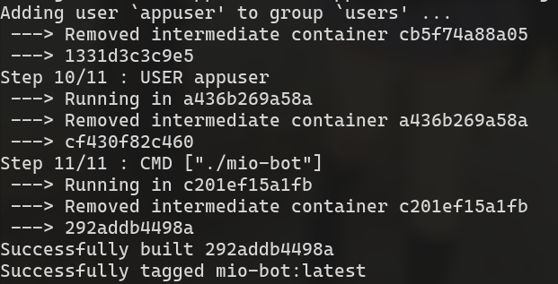
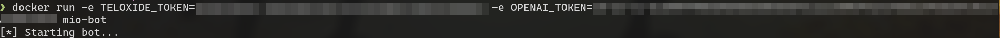
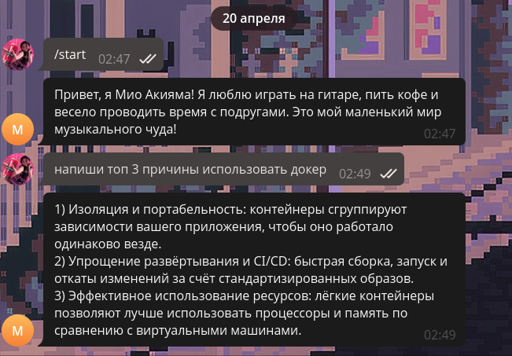
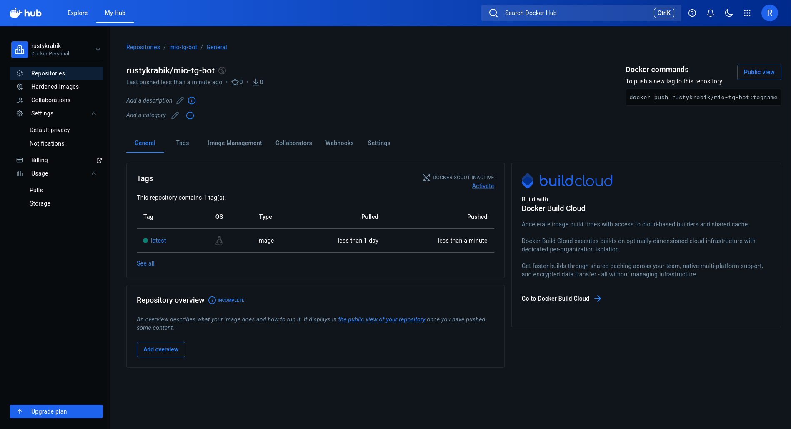

# Цель работы
Получить практические навыки разработки Telegram-ботов на Python, интеграции с языковыми моделями (LLM) через API, а также освоить основы контейнеризации приложений с использованием Docker и публикации образов на Docker Hub.

# Ход работы

## 1. Разработка бота на Rust.

Начнём разработку Telegram бота с установки всех необходимых зависимостей
`Cargo.toml`:
```toml
[package]
name = "mio-bot"
version = "0.1.0"
edition = "2024"

[dependencies]
teloxide = { version = "0.17.0", features = ["macros"] }
log = "0.4"
colog = "1.4.0"
tokio = { version = "1.39", features = ["rt-multi-thread", "macros"] }
reqwest = { version = "0.13.2", features = ["json"] }
serde_json = "1.0.149"
serde = "1.0.228"
```

Т.к бот использует `OpenRouter` для начала былы написанны базовые структуры и функции для работы с 
API `OpenRouter`.
`src/openrouter.rs`:
```rust
// NOTE: I'll separate it in the proper library with full support of OpenRouter API.
// But for now it is what it is ;-;

use reqwest::Client;
use serde::Deserialize;
use serde_json::json;
use std::env;

#[derive(Deserialize, Debug)]
#[serde(untagged)]
enum ApiResp {
    Success { choices: Vec<Choice> },
    Error { error: ErrorBody },
}

#[derive(Deserialize, Debug)]
struct Choice {
    message: Message,
}

#[derive(Deserialize, Debug)]
struct Message {
    content: String,
}

#[derive(Deserialize, Debug)]
struct ErrorBody {
    message: Option<String>,
    metadata: Option<ErrorMeta>,
}

#[derive(Deserialize, Debug)]
struct ErrorMeta {
    raw: Option<String>,
    provider_name: Option<String>,
    is_byok: Option<bool>,
}

pub async fn ask_ai(question: &str) -> Result<String, String> {
    let token = env::var("OPENAI_TOKEN").map_err(|e| format!("OPENAI_TOKEN missing: {}", e))?;

    let body = json!({
        "model": "openrouter/elephant-alpha",
        "messages": [
            {
                "role": "system",
                "content": "You're Mio Akiyama from K-on, answer only in russian"
            },
            {
                "role": "user",
                "content": question
            }
        ]
    });

    let client = Client::new();

    let resp_text = client
        .post("https://openrouter.ai/api/v1/chat/completions")
        .header("Authorization", format!("Bearer {}", token))
        .header("Content-Type", "application/json")
        .json(&body)
        .send()
        .await
        .map_err(|e| format!("request error: {}", e))?
        .text()
        .await
        .map_err(|e| format!("failed to read response body: {}", e))?;

    let api: ApiResp = serde_json::from_str(&resp_text)
        .map_err(|e| format!("failed to parse JSON response: {} -- raw: {}", e, resp_text))?;

    if let ApiResp::Success { choices } = api {
        if let Some(choice) = choices.into_iter().next() {
            return Ok(choice.message.content);
        }
        return Err("no choices/assistant content in success response".into());
    }

    if let ApiResp::Error { error } = api {
        if let Some(meta) = error.metadata {
            if let Some(raw) = meta.raw {
                return Err(raw);
            }
        }
        if let Some(msg) = error.message {
            return Err(msg);
        }
        return Err(format!("error response without message: {}", resp_text));
    }

    Err("unrecognized response format".into())
}
```

Теперь имеется базовый инструментарий с помощью которого можно интегрировать AI в бота. Код самого 
бота представлен ниже
`src/main.rs`:
```rust
use log::LevelFilter;

use teloxide::{
    prelude::*,
};

mod openrouter;

#[tokio::main]
async fn main() {
    colog::basic_builder()
        .filter(None, LevelFilter::Off)
        .filter(Some(env!("CARGO_CRATE_NAME")), LevelFilter::Trace)
        .init();

    log::info!("Starting bot...");

    let bot = Bot::from_env();

    teloxide::repl(bot, |bot: Bot, msg: Message| async move {
        if let Some(text) = msg.text() {
            match openrouter::ask_ai(text).await {
                Ok(reply) => {
                    log::info!("@{}: {}", msg.from().unwrap().clone().username.unwrap(), text);
                    bot.send_message(msg.chat.id, reply).await?;
                }
                Err(err) => {
                    log::error!("On {}: {}", text, err);
                    bot.send_message(msg.chat.id, "Что-то пошло не так").await?;
                }
            }
        } else {
            bot.send_message(msg.chat.id, "Я понимаю только текст ;-;").await?;
        }
        Ok(())
    }).await;
}
```

Из соображений безопасности все ключи к API хранятся в отдельном `.env` файле и не могут быть 
показаны. Далее мы будем с их помощью настраивать контейнер с ботом.

## 2. Контейнеризация
Прежде всего для создания `Docker` образа необходим `Dockerfile`. Его содержтмое представленно ниже.
`Dockerfile`:
```Dockerfile
FROM rust:1-bookworm AS build
WORKDIR /usr/src/app

COPY . .

RUN apt-get update && apt-get install -y pkg-config libssl-dev build-essential ca-certificates && \
    rm -rf /var/lib/apt/lists/*
RUN cargo build --release

# -------------------------------------------------------------------------------------------------

FROM debian:bookworm-slim
WORKDIR /usr/src/app

COPY --from=build /usr/src/app/target/release/mio-bot .

RUN apt-get update && apt-get install -y libssl3 ca-certificates && \
    rm -rf /var/lib/apt/lists/* && \
    adduser --disabled-login --gecos "" appuser && chown appuser:appuser mio-bot

USER appuser

CMD ["./mio-bot"]
```

В силу того, что бот написан на компилируемом языке была использована многоэтапная сбока. Также, 
чтобы `COPY . .` не копировал ничего лишнего был написан файл `.dockerignore`, который работает 
аналогично `.gitignore`
```dockerignore
.env
target
```

В финальном образе было неодходимо установить `libssl3` и `ca-certificates` для корректной работы 
приложения.

## 3. Сборка и запуск Docker-образа

Собрать `Docker` образ можно с помощью следующей команды
```
docker build . -t mio-bot
```
Результат сборки:


Для проверки роботоспособности бота запустим его и напишем ему несколько сообщений.

Запуск:
```
docker run -e TELOXIDE_TOKEN=[REDACTED] -e OPENAI_TOKEN=[REDACTED] mio-bot
```


Чат с ботом:



## 4. Публикация на DockerHub

Для публикации образа на `DockerHub` залогинимся в существующий аккаунт с помощью `docker login`
```
docker login -u rustykrabik -p [REDACTED]
```

Теперь опубликуем образ
```
docker tag mio-bot rustykrabik/mio-tg-bot
docker push rustykrabik/mio-tg-bot:latest
```


Ссылка на `DockerHub`: https://hub.docker.com/repository/docker/rustykrabik/mio-tg-bot/general

# Выводы

Освоены навыки разработки Telegram‑ботов на Rust. Реализована безопасная интеграция с LLM через API: хранение ключей в переменных окружения. Освоена контейнеризация и публикация: написан оптимизированный Dockerfile, протестированы контейнеры локально и загружен образ на Docker Hub

В будующем планируется развить файл `src/openrouter.rs` в полноценную библиотеку, поддерживающую 
все функции API.

